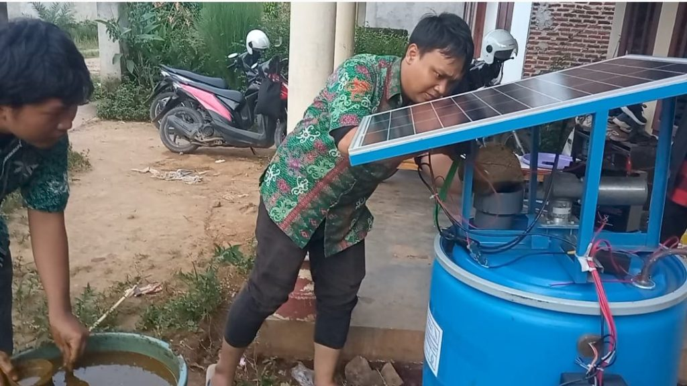
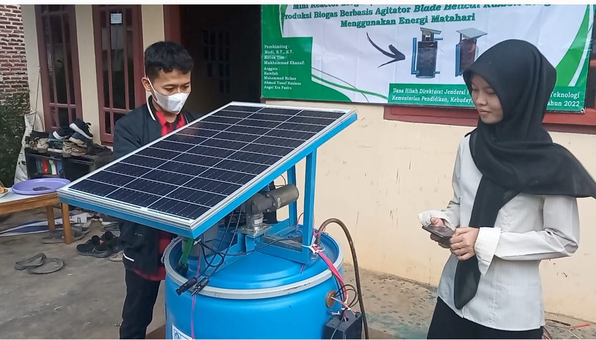
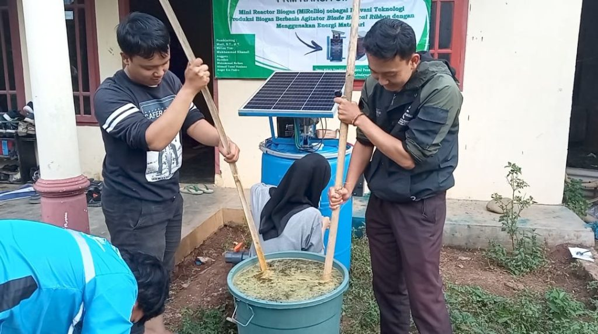

<!-- gunakan ## untuk membuat judul -->
<!-- gunakan ### untuk membuat subjudul -->

ITERA NEWS. Mahasiswa Institut Teknologi Sumatera (ITERA) melalui Program Kreativitas Mahasiswa Karsa Cipta (PKM-KC) yang diadakan Kementerian Pendidikan, Kebudayaan, Riset, dan Teknologi (Kemdikbudristek) membuat prototype Mini Reactor Biogas (MiReBio) berbasis zero waste & green energy sebagai alternatif penggunaan liquefied petroleum gas (elpiji). Tim yang diketuai oleh Mukhammad Khanafi dengan dosen pembimbing Madi, S.T., M.T., melakukan pengujian fungsional prototype Mini Reactor Biogas (MiReBio), Minggu, 4 September 2022.

 

Khanafi menyebut, gagasan membuat MiReBio berawal dari terbatasnya pasokan gas elpiji yang didistribusikan ke desa-desa terpencil di Provinsi Lampung. Selain itu, masih kurangnya pemanfaatan kotoran sapi yang dihasilkan dari peternakan warga untuk dijadikan energi biogas juga menjadi pendorong dibuatnya reaktor biogas sederhana ini. Sehingga Khanafi mengajak rekan-rekan mahasiswa lainnya yaitu, Kamila, Muhammad Raihan, Yusuf  Maulana dan Angel Era Fariza untuk membuat suatu inovasi pengolahan biogas agar dapat dimanfaatkan oleh masyarakat desa dengan skala rumah tangga.

Lebih lanjut, Khanafi menyebut, gagasan Mini Reactor biogas (MiReBio) dengan mengadopsi teknologi dari reaktor biogas jenis CSTR yang menggunakan sistem pengaduk untuk meningkatkan produksi biogas. Pada MiReBio mahasiswa ITERA menggunakan jenis pengaduk blade helical ribbon. Pengaduk tersebut digerakkan menggunakan motor listrik DC dengan sumber energi menggunakan energi matahari dari panel surya jenis monokristalin. Penggunaan panel surya mendukung konsep energi ramah lingkungan yang selama ini menjadi identitas ITERA.

Selain itu, pada reaktor biogas mini karya mahasiswa ITERA juga telah membuat sistem monitoring secara digital menggunakan internet of thinks (IoT), sehingga dapat dimonitoring melalui jarak jauh dengan menggunakan gawai. Hal ini memudahkan pengguna untuk mengetahui anomali parameter yang terjadi pada produksi biogas. “Inovasi ini dibuat bertujuan untuk memanfaatkan limbah yang tidak digunakan mendukung konsep zero waste dengan mengkombinasikan pemanfaatan energi ramah lingkungan atau green energy,” ujar Khanafi.

Reaktor biogas mini karya mahasiswa ITERA juga telah membuat sistem monitoring secara digital menggunakan internet of thinks (IoT), sehingga dapat dimonitoring melalui jarak jauh dengan menggunakan gawai
Proses pengujian fungsional dilakukan untuk memastikan semua fungsi pada sistem MiReBio dapat bekerja dengan optimal. Pengujian yang dilakukan yaitu pengujian fungsional pada sistem kelistrikan dari agitator dan panel surya, dan pengujian reaktor biogas dengan memasukan kotoran sapi dan air pada perbandingan 1:2. Hal ini dilakukan untuk memastikan ada atau tidaknya kebocoran pada reaktor biogas yang telah dibuat.

Khanafi mengatakan, banyak tantangan yang dihadapi dalam membuat reaktor mini biogas tersebut, diantaranya sulitnya menentukan spesifikasi dari setiap komponen, seperti komponen perekat pada reaktor biogas, besar daya dan kekuatan torsi dari motor listrik, spesifikasi panel surya yang digunakan dan bentuk dari agitator. Namun, hal tersebut dapat terselesaikan dengan adanya diskusi intens kepada dosen pembimbing dan para praktisi terkait yang menguasai bidang energi biogas. Sehingga terciptanya MiReBio sebagai inovasi teknologi produksi biogas untuk skala rumah tangga.

Dosen pembimbing mahasiswa, Madi menyebut, pengujian fungsional, berharap inovasi yang dihasilkan mahasiswa ITERA dapat terus dikembangkan lebih lanjut hingga dapat menuju tahap komersialisasi dan dapat diaplikasikan pada masyarakat skala rumah tangga. (Rilis/Humas)