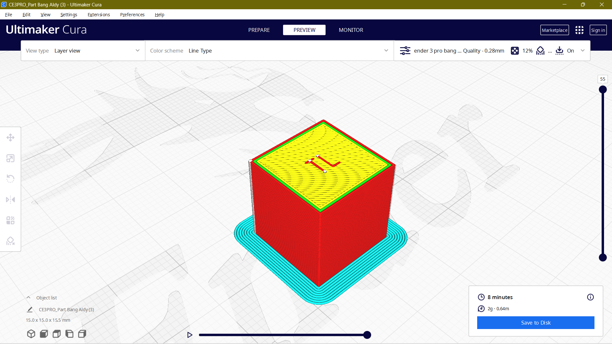
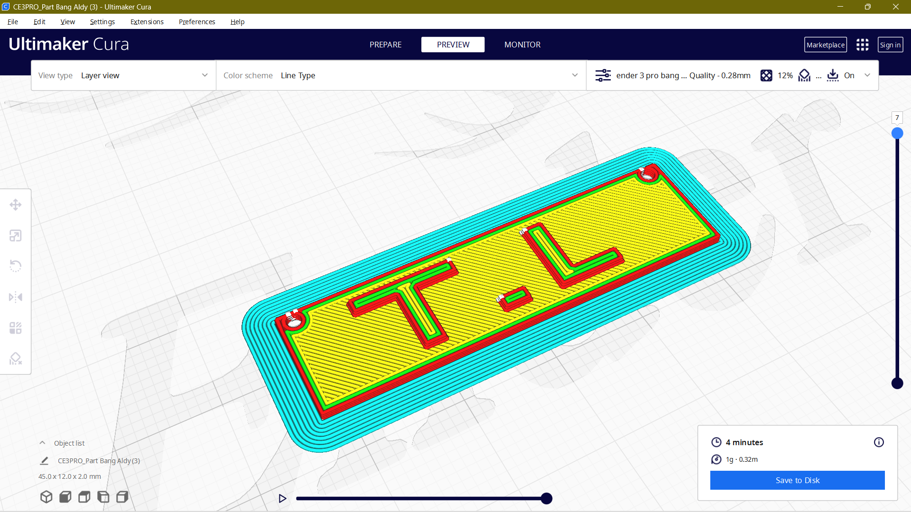

<!-- gunakan ## untuk membuat judul -->
<!-- gunakan ### untuk membuat subjudul -->
<!-- gunakan template dibawah untuk memasukkan gambar  -->
<!--  -->
<!-- ini adalah cara menambahkan link -->
<!-- [ahmad yusuf maulana](https://github.com/yuuahmad) -->
<!-- dan ini adalah emphasis -->
<!-- _jangan pernah mencobanya_ -->
<!-- __jangan pernah mencobanya__ -->

## Latar Belakang
disaat pandemi seperti sekarang, masker sudah menjadi kebutuhan mendasar tiap individu. namun, ketika masker sudah dianggap usang dan tidak layak pakai, kita membuang masker kita disembarang tempat. hal ini sangat buruk untuk lingkungan disekitar kita.

oleh karena itulah, circular economy dibutuhkan dalam pengelolaan limbah masker. agar limbah masker dapat terus digunakan tanpa harus dibuang dan merusak lingkungan. ada beberapa tahap dalam melakukan _recycling_ masker tidak layak pakai. dimulai dari tahap pengumpulan, pembersihan, pengolahan filamen, dan tahap terakhir yaitu pencetakan menggunakan 3d printer.

### pengumpulan bahan
pengumpulan bahan sudah pasti menjadi hal yang pertama kali dilakukan dalam melakukan daur ulang masker. ada beberapa hal yang diperhatikan dalam mengumpulkan masker ini. diantaranya yaitu 

1. masker yang akan didaur ulang sebisa mungkin tidak terlalu kotor, agar memudahkan tahap pembersihan.
2. sebisa mungkin warna masker berwarna sama, dan dari produsen yang sama agar tidak terjadi pencampuran bahan plastik yang tidak diinginkan, dan mengurangi resiko gagal print.
3. masker tidak mengandung bahan kimia lainnya seperti parfum, balsam, minyak angin, dan bahan kimia lainnya.

### pembersihan
tahap pembersihan adalah tahap yang penting dalam melakukan daur ulang masker. tahap ini bertujuan untuk mengurangi partikel dan bahan yang tidak diinginkan dalam plastik. agar nantinya ketika plastik diolah menjadi filamen, tidak ada bahan yang tidak diinginkan masuk kedalam plastik dan merusak 3d printer. contoh partikel yang tidak diinginkan adalah senyawa kimia lain, kerikil, air maupun uap air, warna lain. untuk lebih jelasnya, berikut adalah tahapan pembersihannya.

1. masker yang sudah dikumpulkan dicuci bersih menggunakan air sabun, kemudian dibilas hingga bersih dan tidak menyisakan sisa sabun pada masker
2. kemudian masker dijemur dibawah terik sinar matahari sampai kering. jika sudah, masker kemudian masuk ke dalam oven untuk memastikan air dalam masker tersebut benar-benar hilang.
3. masker yang sudah dioven kemudian ditiriskan di suhu dan kelembaban ruangan yang kering. dan masker siap untuk dikonversi menjadi filamen

### pengolahan filamen
dalam tahap pengolahan masker menjadi filamen, alat yang digunakan harus memiliki tekanan yang tinggi, agar plastik yang dihasilkan tidak memiliki celah udara didalamnya. selain itu, alat pengolah-ini harus dilengkapi dengan motor yang dapat menarik plastik keluar dari lubang extruder dengan kecepatan konstan. hal ini bertujuan agar filamen plastik yang dihasilkan memiliki diameter yang sama, dan tidak mengalami proses karbonisasi _menjadi arang_ seperti gambar dibawah ini

### pencetakan menggunakan 3d printer
setelah filamen telah dibuat, dan memiliki ketebalan yang kurang lebih konstan, filamen ini kemudian diubah menjadi objek 3d print seperti yang diinginkan. sebelum melakukan proses pencetakan, terlebih dahulu harus melalui proses densain bentuk. dalam proses ini, digunakan software yang bernama solidworks. setelah desain-nya jadi, desain tersebut kemudian dimasukkan kedalam slicer 3d printer. disini digunakan slicer cura. berikut adalah tampilan desain, dan hasil jadi dari percobaan 3d print menggunakan filamen masker.

## kesimpulan, saran, dan visi kedepan
ada banyak hal yang harus diperbaiki dalam percobaan ini. diantaranya
1. memperbaiki sistem kerja agar lebih efisien dan cepat.
2. mendapatkan supply plastik selain masker yang dapat didaur ulang
3. memperbaiki alat extruder pembuat filamen agar dapat bekerja secara optimal dan menghasilkan plastik yang konsisten

deminiak artikel ini dibuat. harapan kedepannya, semoga kita menjadi lebih paham tentang sampah yang kita buat. sehingga kita dapat melakukan instrokpeksi pada sampah kita sendiri. __mau dikemanakan sampah kita?__