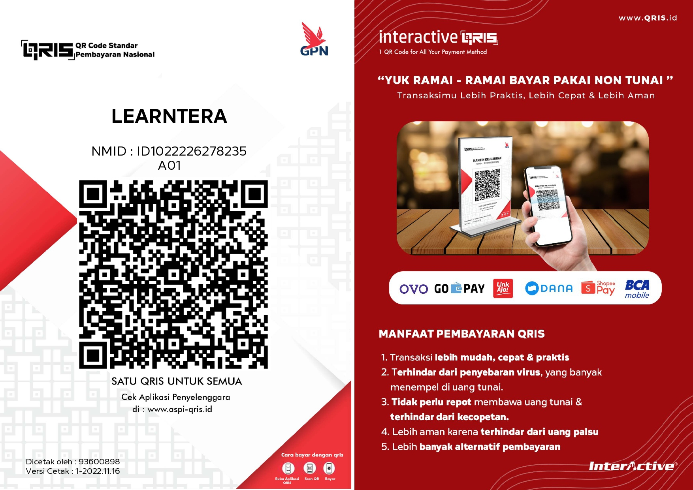

<!-- gunakan ## untuk membuat judul -->
<!-- gunakan ### untuk membuat subjudul -->
<!-- gunakan template dibawah untuk memasukkan gambar  -->
<!--  -->
<!-- ini adalah cara menambahkan link -->
<!-- [ahmad yusuf maulana](https://github.com/yuuahmad) -->
<!-- dan ini adalah emphasis -->
<!-- _jangan pernah mencobanya_ -->
<!-- __jangan pernah mencobanya__ -->
 
 ## Latar Belakang
Halo semua, saya ingin memperkenalkan kepada kalian learntera.org sebuah website yang saya buat untuk menyebarkan berita, inovasi, dan hasil riset dan pengembangan ilmu di bidang teknologi. Melalui learntera, saya berharap bisa berkontribusi dalam menciptakan inovasi baru yang bermanfaat bagi masyarakat.

Namun, seperti yang kalian ketahui, riset dan pengembangan ilmu di bidang teknologi memerlukan biaya yang tidak sedikit. Oleh karena itu, saya mengajak kalian untuk berdonasi kepada learntera, agar saya bisa terus melakukan riset dan pengembangan yang lebih baik lagi.

Setiap donasi yang kalian berikan akan sangat berarti bagi pengembangan learntera. Tidak peduli seberapa besar atau kecil donasi yang kalian berikan, setiap kontribusi sangat berharga bagi kami.

Jika kalian ingin berdonasi, silakan kunjungi website learntera dan klik tombol "Donasi" di halaman utama. Saya berharap kita bisa berkolaborasi untuk menciptakan inovasi baru yang bermanfaat bagi masyarakat. Terima kasih atas perhatian dan dukungan kalian! :3

## Penggunaan Dana
dana yang telah terkumpul akan saya gunakan sebaik-baiknya untuk riset dan pengembangan tekologi dibidang yang saya miliki seperti 3d printer, cnc milling, composite material, wind turbine, dan berbagai jenis teknologi lainnya yang sekiranya dapat membantu masyarakat untuk berkembang menjadi lebih baik.

selain itu, dana ini juga akan saya gunakan untuk melakukan maintenance pada website ini. meliputi perpanjangan sewa domain, ekspansi kemampuan dan kapasitas server, perpanjangan sewa ssl, perpanjangan sewa google drive, dan software atau layanan online lain yang sekiranya dibutuhkan

## Qris Learntera

