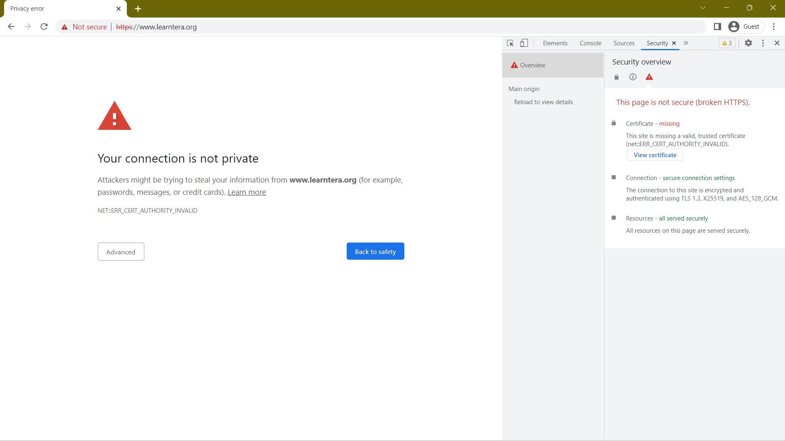
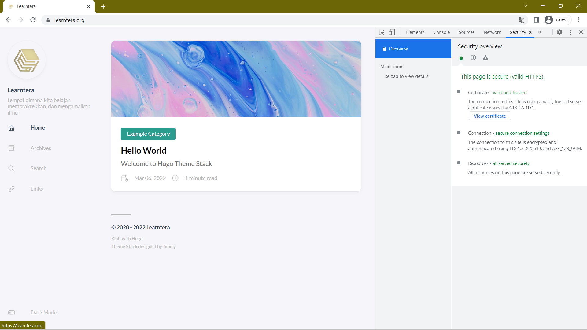
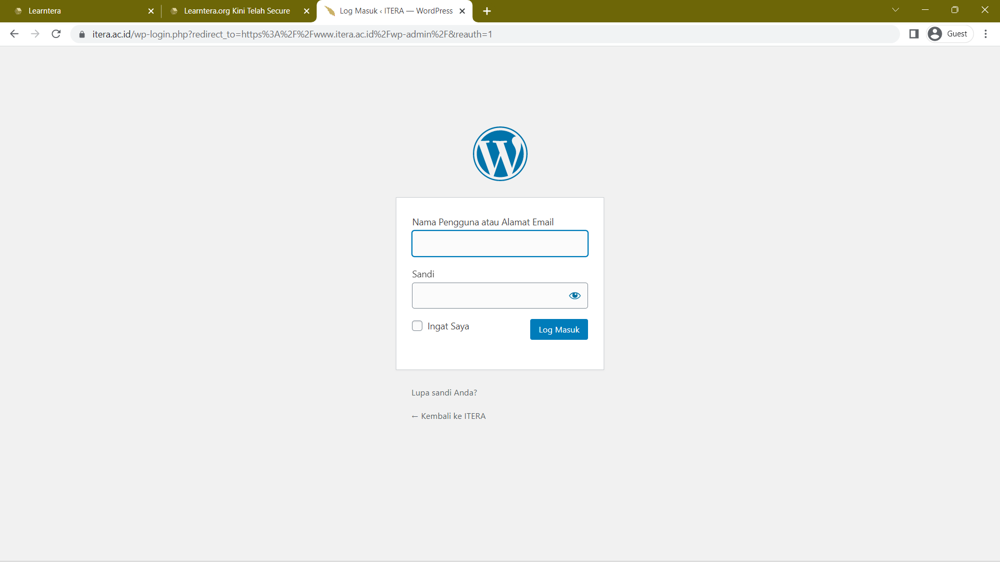

<!-- gunakan ## untuk membuat judul -->
<!-- gunakan ### untuk membuat subjudul -->
<!-- gunakan template dibawah untuk memasukkan gambar  -->
<!--  -->
## Latar Belakang
jika kalian perhatikan, website learntera sebelumnya tidak bisa dibuka jika menggunakan wifi itera. hal ini karena wifi itera memblokir semua situs yang belum memiliki sertifikat keamanan web. hal ini bisa dilihat dari alamat websitenya yang masih diawali dengan http:// dan inilah yang sedang dihadapi oleh website learntera.org sebelumnya. berikut adalah gambar screenshot yang diambil sebelum melakukan upgrade keamanan

dan berikut adalah tampilan website setelah melakukan upgrade keamanan

## Manfaat
dengan adanya protokol https:// ini, dihaprapkan website itera tidak akan bisa dihack atau diretas oleh pihak yang tidak bertanggung jawab. sehingga dapat terus menyediakan manfaat bagi semua orang yang ingin mencari ilmu.

selain itu, dengan menambahkan fitur keamanan ini, website learntera memiliki fitur pencarian yang handal dan cepat. sehingga kalian dapat mencari semua hal yang dadpat kalian bayangkan tanpa perlu mencari artikel satu persatu didalam website learntera.org ini sangat membantu dikemudian hari jika website learntera.org sudah menjadi website yang berkembang dan memiliki banyak artikel didalamnya.

## Keamanan Tambahan Lain
selain menggunakan protokol keamanan ssl, kami juga menambahkan keamanan kepada website learntera.org dengan menggunakan framework hugo. kelebihan dari framework ini adalah mudah digunakan, mudah diaplikasikan, tidak memiliki database (sehingga tidak bisa diretas) dan memiliki tampilan yang menarik jika dikustomisasi dengan benar.

kalian dapat melihat langsung bagaimana cara memprogram website menggunakan hugo pada link yang tersedia pada kolom paling bawah artikel ini. dan, jika kalian tertarik learntera akan membuka kelas gratis bagi kalian yang nantinya akan membahas seputar web development dengan framework hugo.

sebelum admin mengakhiri artikel ini, admin akan memberikan kalian salah satu celah keamanan dari website [itera.ac.id](https://itera.ac.id) jika diperhatikan, website itera telah memilki keamanan https:// namun, website ini masih manggunakan CMS wordpress yang notabene-nya memiliki banyak celah keamanan. jika kalian mengetikkan alamat [https://itera.ac.id/admin](https://itera.ac.id/admin) kalian dapat melihat tampilan seperti dibawah ini.

tinggal masalah waktu saja sampai ada seseorang yang mengetahui password dan username-nya sehingga dapat masuk ke dashboard utamanya. __#jangan pernah mencobanya__
